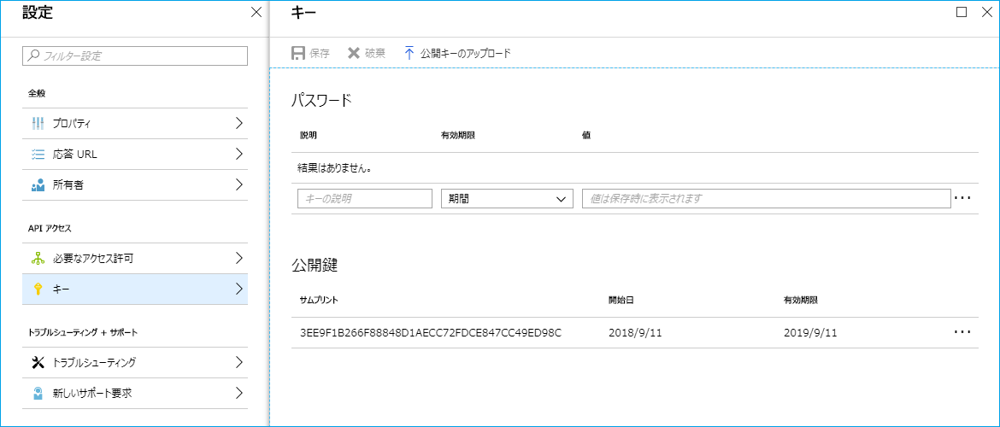

# Get sign-in activity reports with certificate
Shows how to download sign-in activity log on Azure AD using AcquireTokeAsync method with PowerShell

PowerShell スクリプトで Microsoft Graph API および証明書を利用して Azure AD のサインイン アクティビティ レポートを csv 形式で取得する方法を紹介します。

平文のキーではなく証明書を用いたトークン取得を推奨しております。以下に一連の手順をおまとめしましたので、参考としていただければ幸いです。大まかに 3 つの手順に分けて解説いたします。

## 1. 認証に使用する証明書の準備

今回は上述のとおり、トークン取得に証明書を用います。これは、これまでの平文のキーを用いる方法よりもセキュリティ的に強力であり、弊社としても推奨している方法です。CreateAndExportCert.ps1 を実行すると、自己署名証明書が生成され、ユーザーの証明書ストア (個人) に格納します。さらに、公開鍵を .cer ファイルでカレント ディレクトリに出力します。

以下が実行結果の例です。

```
PS C:\temp\get-signin-activity-reports-with-certificate-master> .\CreateAndExportCert.ps1


   PSParentPath: Microsoft.PowerShell.Security\Certificate::CurrentUser\My

Thumbprint                                Subject
----------                                -------
3EE9F1B266F88848D1AECC72FDCE847CC49ED98C  CN=SelfSignedCert

LastWriteTime : 2018/09/11 11:52:53
Length        : 784
Name          : SelfSignedCert.cer
```

## 2. 処理に必要なライブラリを nuget で取得するスクリプト

証明書を用いたトークン取得処理はライブラリを用いて行います。処理に必要なライブラリを nuget で取得します。GetAdModuleByNuget.ps1 を実行ください。本スクリプトを実行すると、実行フォルダー配下にフォルダーができ、Microsoft.IdentityModel.Clients.ActiveDirectory.dll などのファイルが保存されます。

## 3. サインイン ログを取得するスクリプト

証明書の準備および実行に必要なライブラリの準備が整いましたら、以下の手順で、アプリケーションおよびスクリプトを準備します。まず、以下のドキュメントに記載された手順に従って、アプリケーションを登録し、"構成設定を収集する" に従ってドメイン名とクライアント ID を取得します。

Azure AD Reporting API にアクセスするための前提条件  
https://docs.microsoft.com/ja-jp/azure/active-directory/active-directory-reporting-api-prerequisites-azure-portal

また、キーを登録する代わりに、[公開キーのアップロード] を選択し、カレント ディレクトリにエクスポートされた証明書 SelfSignedCert.cer をアップロードします。



続いて、GetSigninReportsWithCert.ps1 ファイルを開き、以下の 3 行を確認した結果に合わせて変更します。$thumprint は上記例の証明書の値にしていますので、$tenantId と $clientId を適宜変更ください。

```powershell
$tenantId = "yourtenant.onmicrosoft.com" # or GUID "01234567-89AB-CDEF-0123-456789ABCDEF"
$clientId = "FEDCBA98-7654-3210-FEDC-BA9876543210"
$thumprint = "3EE9F1B266F88848D1AECC72FDCE847CC49ED98C"
```

最後に、GetSigninReportsWithCert.ps1 を実行します。これによりサインイン アクティビティ レポートを csv ファイルとして取得できます。

## 認証処理の内部動作

証明書を使用した認証処理では、内部的に JWT (JSON Web Token) を作成し、それを Authorization ヘッダーに Bearer トークンとして添えることで Graph API へアクセスしています。

```
GET https://graph.microsoft.com/beta/auditLogs/signIns HTTP/1.1
Authorization: Bearer eyJ0eXAiOi{省略}3lISmxZIn0.eyJhdWQiOi{省略}joiMS4wIn0.FDlzA1xpic{省略}Nj_6yECdIw
```

この JWT の元となる内容は以下のとおりです。署名部分を省略しヘッダーとペイロード部分のみ記載しています。

```json
{
    "typ": "JWT",
    "nonce": "AQABAAAAAADXzZ3ifr-OFFflk0UqNNhRkgaPb7FXuHq_UgZSzHR9grrjY7u1LYqCAA",
    "alg": "RS256",
    "x5t": "i6lGk3FZzxRcUb2C3nEQ7syHJlY",
    "kid": "i6lGk3FZzxRcUb2C3nEQ7syHJlY"
}
{
    "aud": "https://graph.microsoft.com",
    "iss": "https://sts.windows.net/{Tenant ID}/",
    "iat": 1536634703,
    "nbf": 1536634703,
    "exp": 1536638603,
    "aio": "42BgYMhlTTieKKaxXv/Z1gU9rOJLAA==",
    "app_displayname": "{Application Display Name}",
    "appid": "{Application GUID}",
    "appidacr": "2",
    "idp": "https://sts.windows.net/{Tenant ID}/",
    "oid": "{Service Principal GUID}",
    "roles": [
        "AuditLog.Read.All"
    ],
    "sub": "{Service Principal GUID}",
    "tid": "{Tenant ID}",
    "uti": "-q3qac-PTU2tpxsoGTECAA",
    "ver": "1.0"
}
```

AcquireTokenAsync メソッドを使わずとも、自身で上記の JWT を作成 (自身で署名) すれば、同様の処理を実施いただけます。アサーションのフォーマットについては以下をご覧ください。

Certificate credentials for application authentication  
https://docs.microsoft.com/en-us/azure/active-directory/develop/active-directory-certificate-credentials
